# chiken
The icon of kotaoue

## Usage
```
# basic
go run main.go

# walk style
go run main.go -s=walk
```

## Args Example
|args|theme|style|size|background|image|
|---|---|---|---|---|---|
||white|basic|32*32|transparent||
|-s=walk|white|walk|32*32|transparent||
|-s=wide|white|wide|32*32|transparent||
|-s=tiptoe|white|tiptoe|32*32|transparent||
|-s=jump|white|jump|32*32|transparent||
|-f=gif -s=basic-walk|white|basic-walk|32*32|transparent||
|-f=gif -s=basic-walk -d=16|white|basic-walk|32*32|transparent||
|-f=gif -s=basic-tiptoe -d=16|white|basic-tiptoe|32*32|transparent||
|-f=gif -s=basic-jump -d=16|white|basic-jump|32*32|transparent||
|-t=panda|panda|basic|32*32|transparent|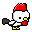|
|-t=brown|brown|basic|32*32|transparent|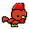|
|-t=brownBlack|brownBlack|basic|32*32|transparent|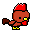|
|-t=black|black|basic|32*32|transparent||
|-t=yellow|yellow|basic|32*32|transparent|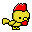|
|-t=green|green|basic|32*32|transparent|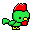|
|-t=mossGreen|mossGreen|basic|32*32|transparent|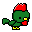|
|-t=lightBlue|lightBlue|basic|32*32|transparent|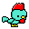|
|-t=blue|blue|basic|32*32|transparent|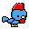|
|-t=bluePurple|bluePurple|basic|32*32|transparent|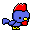|
|-t=purple|purple|basic|32*32|transparent|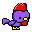|
|-t=pinkPurple|pinkPurple|basic|32*32|transparent|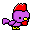|
|-t=pink|pink|basic|32*32|transparent|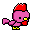|
|-t=red|red|basic|32*32|transparent|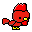|
|-t=orange|orange|basic|32*32|transparent|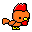|
|-t=gray|gray|basic|32*32|transparent|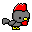|
|-t=player2|player2|basic|32*32|transparent|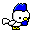|
|-t=player3|player3|basic|32*32|transparent||
|-t=player4|player4|basic|32*32|transparent|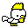|
|-b=#ffffff|white|basic|32*32|#ffffff||
|-m=2|white|basic|64*64|transparent||
|-f=gif -s=basic-tiptoe-basic-tiptoe-basic-jump -d=64 -m=3|white|basic-tiptoe-basic-tiptoe-basic-jump|96*96|transparent||
