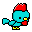

# chiken
The icon of kotaoue

## Usage
```
# basic
go run main.go

# walk style
go run main.go -s=walk
```

## Args Example
|args|theme|style|effect|size|background|image|
|---|---|---|---|---|---|---|
||white|basic||32*32|transparent||
|-s=walk|white|walk||32*32|transparent||
|-s=wide|white|wide||32*32|transparent||
|-s=tiptoe|white|tiptoe||32*32|transparent||
|-s=jump|white|jump||32*32|transparent||
|-s=sleep|white|sleep||32*32|transparent||
|-s=deepSleep|white|deepSleep||32*32|transparent||
|-s=wake|white|wake||32*32|transparent||
|-f=gif -s=basic-walk|white|basic-walk||32*32|transparent||
|-f=gif -s=basic-walk -d=16|white|basic-walk||32*32|transparent||
|-f=gif -s=basic-tiptoe -d=16|white|basic-tiptoe||32*32|transparent||
|-f=gif -s=basic-jump -d=16|white|basic-jump||32*32|transparent||
|-t=panda|panda|basic||32*32|transparent||
|-t=brown|brown|basic||32*32|transparent||
|-t=brownBlack|brownBlack|basic||32*32|transparent||
|-t=black|black|basic||32*32|transparent||
|-t=yellow|yellow|basic||32*32|transparent||
|-t=green|green|basic||32*32|transparent||
|-t=mossGreen|mossGreen|basic||32*32|transparent||
|-t=lightBlue|lightBlue|basic||32*32|transparent||
|-t=blue|blue|basic||32*32|transparent||
|-t=bluePurple|bluePurple|basic||32*32|transparent||
|-t=purple|purple|basic||32*32|transparent||
|-t=pinkPurple|pinkPurple|basic||32*32|transparent||
|-t=pink|pink|basic||32*32|transparent||
|-t=red|red|basic||32*32|transparent||
|-t=orange|orange|basic||32*32|transparent||
|-t=gray|gray|basic||32*32|transparent||
|-t=player2|player2|basic||32*32|transparent||
|-t=player3|player3|basic||32*32|transparent||
|-t=player4|player4|basic||32*32|transparent||
|-t=player5|player5|basic||32*32|transparent||
|-t=vivid|vivid|basic||32*32|transparent||
|-t=random|random|basic||32*32|transparent||
|-t=random -n=random1|random|basic||32*32|transparent||
|-t=random -n=random2|random|basic||32*32|transparent||
|-e=negative|white|basic|negative|32*32|transparent||
|-e=grayscale|white|basic|grayscale|32*32|transparent||
|-e=negative-grayscale|white|basic|negative-grayscale|32*32|transparent||
|-f=gif -e=rightLoop1|white|basic|rightLoop1|32*32|transparent||
|-f=gif -e=rightLoop4|white|basic|rightLoop4|32*32|transparent||
|-f=gif -e=leftLoop1|white|basic|leftLoop1|32*32|transparent||
|-e=mirror|white|basic|mirror|32*32|transparent||
|-f=gif -t=white-player2-player3-player4|white-player2-player3-player4|basic||32*32|transparent||
|-t=party1|party1|basic||32*32|transparent||
|-f=gif -t=party8|party8|basic||32*32|transparent||
|-f=gif -t=party16|party16|basic||32*32|transparent||
|-f=gif -t=party32|party32|basic||32*32|transparent||
|-f=gif -t=party32 -s=basic-tiptoe|party32|basic-tiptoe||32*32|transparent||
|-b=#ffffff|white|basic||32*32|#ffffff||
|-m=2|white|basic||64*64|transparent||
|-f=gif -s=basic-tiptoe-basic-tiptoe-basic-jump -d=64 -m=3|white|basic-tiptoe-basic-tiptoe-basic-jump||96*96|transparent||